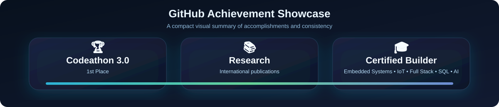
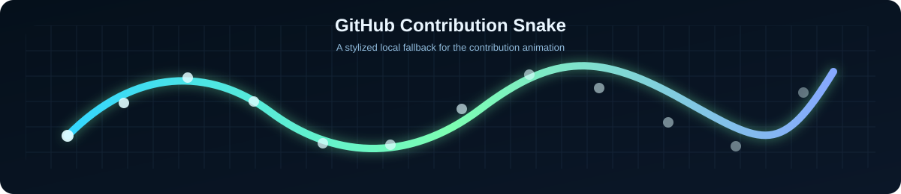

  

## 👨‍💻 About Me

I’m Harishwaran P, a B.Tech student in Artificial Intelligence and Data Science at DMI College of Engineering, Chennai, graduating in 2026. I enjoy building products that blend clean UI, practical engineering, and AI-driven ideas, and I’ve applied that mindset across internships in data analysis, full-stack development, and lean manufacturing.

I work comfortably across React.js, Python, Node.js, Supabase, Firebase, Power BI, Docker, and Figma, and I like shipping projects that feel polished while solving real problems.

## 🚀 Featured Projects

<table>
  <tr>
    <td width="33%" valign="top">
      <h3>FinEcho</h3>
      
AI-focused finance experience designed for clarity and modern interaction.

      <a href="https://fin-echo.vercel.app/">Live Demo</a>
    </td>
    <td width="33%" valign="top">
      <h3>TastyLens-AR</h3>
      
Augmented reality food discovery concept built for a more engaging browsing flow.

      <a href="https://tastylensar.vercel.app/">Live Demo</a>
    </td>
    <td width="33%" valign="top">
      <h3>Heal-Fit</h3>
      
Wellness-oriented web app focused on habit tracking and a simple user experience.

      <a href="https://heal-fit.vercel.app/">Live Demo</a>
    </td>
  </tr>
</table>

## 🛠 Tech Stack

  

## 📊 GitHub Stats

  
  

## 🔥 GitHub Streak

  

## 📈 Activity Graph

  

## 🏆 GitHub Trophies

  

## 🐍 GitHub Contribution Snake

  

## 📊 Dynamic GitHub Metrics Dashboard

  

  
  
  
  

## 💼 Experience Timeline

<table>
  <tr>
    <td><strong>2022 - 2026</strong></td>
    <td>B.Tech in Artificial Intelligence and Data Science at DMI College of Engineering, Chennai.</td>
  </tr>
  <tr>
    <td><strong>Internship</strong></td>
    <td>Data analysis experience at Vulture Lines Pvt Ltd, with a focus on reporting and insight generation.</td>
  </tr>
  <tr>
    <td><strong>Internship</strong></td>
    <td>Full stack development at Novitech Pvt Ltd, building responsive applications and RESTful APIs.</td>
  </tr>
  <tr>
    <td><strong>Early Experience</strong></td>
    <td>Lean manufacturing exposure at Hyundai Transys Lear, improving production efficiency and process thinking.</td>
  </tr>
</table>

## 📜 Certifications

<table>
  <tr>
    <td>Embedded Systems</td>
    <td>IoT</td>
    <td>Full Stack Development</td>
    <td>SQL</td>
    <td>AI</td>
  </tr>
</table>

## 🌐 Social Links

  <a href="https://harishwaran.tech">Portfolio</a> •
  <a href="https://www.linkedin.com/in/harishwaran1">LinkedIn</a> •
  <a href="mailto:harishwaran@hexpertify.com">Email</a> •
  <a href="mailto:mail@harishwaran.tech">Alternate Email</a>

## 🎯 Visitor Counter

  

  

  <strong>✨ Building polished experiences with curiosity, consistency, and AI-powered creativity ✨</strong>

